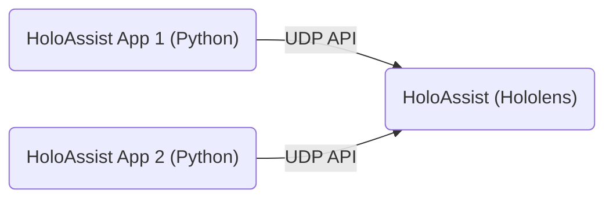

# How to write a HoloAssist App

## High level overview

HoloAssist has been designed to allow to easily develop augmented reality (AR) visualizations for fixed-platform flight simulator like this one:


HoloAssist is a Hololens application, designed to run on such devices and to expose a UDP API, that is, a programming interface that allows to easily express the shape of the desired augmentation: HoloAssist will then do all the work required to actually show the desired result on the simulator.

This overall architecture looks as follows:



Users can write small Python scripts that use the HoloAssist API to draw agumentations without having to setup an entire Hololens development environment and, more importantly, without having to deal with the complexity introduced by the head-mounted display.

> Technically, users can use any language that is able to write UDP packets to interfact with HoloAssist. As Python is a fairly common language in the science community, a preferential path for it has been prepared.

## HoloAssist's interface

HoloAssist allows to create two types of augmentations:

* _geo-fixed augmentations_: these augmentations are "attached" to a point on the Earth. An example is an augmentation that draws the outline of the runway of an airport. Users looking outside the simulator's cockpit window will be able to see these augmentations on top of the "real" geographical world.
* _plane-fixed augmentations_: these augmentations are "attached" to a point of the plane cockpit. An example is an augmentation that highlights the main throttle lever inside the cockpit.

Both these types of augmentations are described as 3D meshes with line topology. This means that each augmentation is composed by a list of points (identifying locations in some space, more details later) and by a list of lines connecting these points. The Python programs submit and modify these two lists to HoloAssist via the API.

> "Common" 3D meshes use triangles instead of lines, but currently HoloAssist only supports meshes with line topology.

The representation of the list of lines is similar to what is usually done in 3D graphics. As an example, assume that the list of vertices contains `5` vertices `v0`, `v1`, `...`, `v4`: the position of each vertex in this list is called "the index of the vertex", so for example `v0` has index `0`. The list of lines is composed by pair of numbers, with each number representing the index of (respectively) the start and end vertex of the line. For example, in order to describe the mesh composed by a line connecting `v1` and `v4` and a line connecting `v1` and `v2`, the list of lines will be `[1, 4, 1, 2]`.

The less straightforward part regards how a vertex is represented: vertices for geo-fixed augmentations and plane-fixed augmentations have radically different representations, and will be described in the following sections.

## HoloAssistService

The `/lib` folder contains a set of utilities that simplify the interaction with HoloAssist. The main one of such utilities is `HoloAssistService`, a Python class that wraps the HoloAssist API, making it easy to use from a Python script.

## A first geo-fixed augmentation

Let's highlight the runway of the Munich airport (the full code is available in `src/munich_runway.py`). The first step is to acquire the geographical position of the corners of the runway from Google Maps:

| Latitude | Longitude | Altitude |
|:--------:|:---------:|:--------:|
|48.363062|11.767553|453|
|48.367189|11.821082|453|
|48.366616|11.821204|453|
|48.362511|11.767624|453|

In a new `.py` file, the utilities from `lib` can be imported and used to create the instance of `HoloAssistService`, which will allow to send commands to HoloAssist:

```python
from lib import prepare_holo_assist_instance
from lib.holo_assist_types import Color, GeoFixedVertex, WGS84Point

service = prepare_holo_assist_instance()
```

In order to draw a rectangle around the runway, we need to define the list of vertices and list of lines for the desired rectangle. For geo-fixed augmentations, HoloAssist expects vertices of type `GeoFixedVertex`:

```python
color = Color(0.0, 0.4, 0.0) # Red, Green, Blue, ranging from 0.0 to 1.0
vertices = [
    GeoFixedVertex(WGS84Point.from_degrees(48.363062, 11.767553, 453), color),
    GeoFixedVertex(WGS84Point.from_degrees(48.367189, 11.821082, 453), color),
    GeoFixedVertex(WGS84Point.from_degrees(48.366616, 11.821204, 453), color),
    GeoFixedVertex(WGS84Point.from_degrees(48.362511, 11.767624, 453), color)
]
```
 
Each `GeoFixedVertex` allows to specify a geographical position (latitude, longitude and altitude) at which the vertex should be placed and a color with which it should be drawn. Given this list of vertices, the list of lines is as follows:

```python
indices = [0, 1, 1, 2, 2, 3, 3, 0]
```

This augmentation will be composed by four lines, connecting vertices `0` and `1`, `1` and `2`, `2` and `3` and `3` and `0`, forming a rectangle. 

At this point, the two lists can be sent to HoloAssist. The first step is to create a geo-fixed augmentation with a certain name (`EDDM 08 L` in our example). The vertices and indices and then be added to this augmentation:

```python
MESH_ID = "EDDM 08 L"

service.create_mesh(MESH_ID)
service.add_mesh_vertices(MESH_ID, vertices)
service.add_mesh_indices(MESH_ID, indices)
```

At this point, nothing has changed in what is displayed by HoloAssist, as it does not apply immediately the requested changes (in this case, the addition of vertices and indices). Since applying the changes is an expensive operation, HoloAssist allows users to submit a number of changes and only then, once everything is ready, to actually apply them to what is displayed. This can be done as follows:

```python
service.commit_mesh_changes(MESH_ID)
```

At this point, nothing is shown. This is because new augmentations are by default disabled by HoloAssist. They can be displayed with the following API call:

```python
service.activate_mesh(MESH_ID)
```

Augmentations can be similarly deactivated, to temporarely hide them without deleting them. After executing this script, the result visibile from the Hololens is as follows:


## A tunnel-like geo-fixed augmentation

A slightly more complex geo-fixed augmentation is one that draws a tunnel-like mesh, often used to show an approach trajectory. Most of the Python script will remain unchanged, the only difference will be in the vertex and index list.

In order to keep this example small, our tunnel will be very simple: it will have one rectangular "entry" placed above one of the short sides of the Munich airport runway and one rectangular "exit" placed above the other short side of the runway. The two rectangles will be connected by straight lines that outline the tunnel.

To achieve this result, the more advanced features of the `GeoFixedVertex` are needed. This type of vertex is more complex than what showed above, because it allows to specify:

* a geographical point, identified by its latitude, longitude and altitude;
* a local translation;
* a local rotation;
* a color.

What was used above for the runway was actually a `GeoFixedVertex` with `local translation` and `local rotation` equal to zero, which yielded a point fixed exactly at the latitude and longitude specified. In its more complete form, a `GeoFixedVertex` establishes a local tangent plane at a certain position on the Earth (in green in the image):


This tangent plane is an approximation of the Earth surface around a geographical point, and allows to reason in a much more practical Euclidean space (rather than the one defined by latitude and longitude). The geographical position of a `GeoFixedVertex` specifies the origin of this tangent plane, and the `local translation` of a `GeoFixedVertex` specifies an offset along (respectively) the `E`, `U` and `N` axes (as shown in the image above). Due to how HoloAssist works, when the simulator is flying with zero heading (and zero pitch and roll), the North (`N`) axis corresponds with the plane longitudinal axis (`Z axis`) and the Up (`U`) axis corresponds with the plane vertical axis (`Y axis`).

This can be used to draw a rectangle around a certain geographical position, as we need to do for the tunnel mesh:

```python
c = Color(0.0, 0.4, 0.0)
p1 = WGS84Point.from_degrees(48.363062, 11.767553, 700)
p2 = WGS84Point.from_degrees(48.367189, 11.821082, 700)

vertices = [
    GeoFixedVertex(p1, c, Vector3(0.0, -10.0, +20.0)),
    GeoFixedVertex(p1, c, Vector3(0.0, +10.0, +20.0)),
    GeoFixedVertex(p1, c, Vector3(0.0, +10.0, -20.0)),
    GeoFixedVertex(p1, c, Vector3(0.0, -10.0, -20.0)),

    GeoFixedVertex(p2, c, Vector3(0.0, -10.0, +20.0)),
    GeoFixedVertex(p2, c, Vector3(0.0, +10.0, +20.0)),
    GeoFixedVertex(p2, c, Vector3(0.0, +10.0, -20.0)),
    GeoFixedVertex(p2, c, Vector3(0.0, -10.0, -20.0)),
]
```

Finally, the index list needs to draw the two rectangles and then connect them:

```python
indices = [
    0, 1, 1, 2, 2, 3, 3, 0,
    4, 5, 5, 6, 6, 7, 7, 4,
    0, 4,
    1, 5,
    2, 6,
    3, 7
]
```

These two lists can then be sent to HoloAssist in the same way as it was done for the runway.

## A simple plane-fixed augmentations

Comparatively, plane-fixed augmentations are simpler. The complete code for this example is in `/src/cabin_augmentation.py`. The overall procedure is very similar to geo-fixed augmentations, with a couple of differences:

* The name of the methods to be invoked on the `HoloAssistService` instance is slightly different
* The vertices are not of type `GeoFixedVertex` but of the much simpler `ColoredVertex` type

A `ColoredVertex` allows to only specify a color and a vertex position. This position is with respect to the origin of the 3D model of the flight simulator: the `Z` axis is parallel to the plane longitudinal axis and the `Y` axis is parallel to the plane vertical axis.

The following piece of code shows how to draw a plane-fixed rectangle around the gear lever:

```python
from lib import prepare_holo_assist_instance
from lib.holo_assist_types import Vector3, Color, ColoredVertex, Rotation

c = Color(0.0, 0.4, 0.0)
vertices = [
    ColoredVertex(Vector3(0.494726, 0.368722, 1.003500), c)
    ColoredVertex(Vector3(0.494726, 0.253980, 0.955498), c)
    ColoredVertex(Vector3(0.619104, 0.368722, 1.003500), c)
    ColoredVertex(Vector3(0.619104, 0.253980, 0.955498), c)
]

indices = [2, 0, 0, 1, 1, 3, 3, 2]
MESH_ID = "GEAR_LEVER"

service = prepare_holo_assist_instance()
service.plane_fixed_create_mesh(MESH_ID)
service.plane_fixed_add_mesh_vertices(MESH_ID, vertices)
service.plane_fixed_add_mesh_indices(MESH_ID, indices)
service.plane_fixed_commit_mesh_changes(MESH_ID)
service.plane_fixed_activate_mesh(MESH_ID)
```

The coordinates for the vertices can be obtained by drawing the desired augmentation in Blender, using the 3D scanned model as a visual reference. The augmentation can then be exported as an OBJ file and loaded to HoloAssist.

## From here

This is a quick introduction on how to use HoloAssist. The Python scripts already available in this repository can serve as a guide to more complex use cases.

A few last remarks:

* In order for `HoloAssistService` to work, the IP address of the Hololens in `/src/lib/__init.py` must be correct
* HoloAssist outputs debug information via UDP: starting Wireshark on the correct IP and port allows to read them. The IP and port to which HoloAssist sends information can (unfortunately) only be changed from Unity by recompiling the application.